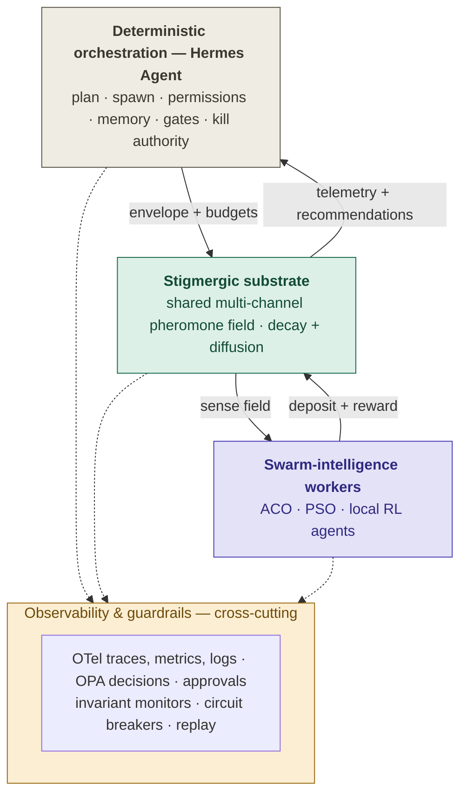

# Hybrid Agentic Swarm (HAS) — Reference Architecture v2

**Deterministic multi-agent orchestration as an envelope, swarm emergence inside it.** HAS couples a governed control plane — **Hermes Agent (Nous Research)** in v2 — with a decentralized swarm-intelligence layer, through exactly one medium: a stigmergic (pheromone-field) substrate. Orchestration owns invariants, budgets, permissions, and kill authority; the swarm owns search, adaptation, and local decisions; a policy plane decides what may become real; an observability plane remembers everything important.



## What's in v2

The formal four-plane reference architecture with its interface contract spec, and the conceptual architecture built on the containment principle — and substitutes **Hermes Agent** for OpenClaw as the deterministic orchestration runtime. The swap brings native equivalents for things v1 specified externally: Bitwarden-scoped credentials, terminal-backend sandboxing (Docker/Modal/Daytona), promptware/injection defense at three chokepoints, a messaging gateway for human approvals, per-task model overrides for the cheap-worker/heavy-reasoner split, and Atropos RL + trajectory export as the Layer 3 training substrate. Full details: [docs/ARCHITECTURE.md](docs/ARCHITECTURE.md) · [docs/CONTRACTS.md](docs/CONTRACTS.md) · [docs/MIGRATION_V1_TO_V2.md](docs/MIGRATION_V1_TO_V2.md).

The reference implementation in `src/has/` is pure Python standard library — no dependencies — and runs the entire loop: mission intake, governed spawn, multi-channel pheromone field with decay/diffusion/saturate-guard and poisoning defenses, ACO routers + PSO tuner + scouts + sentinels, difference rewards, OPA-shaped policy decisions with action classes 0–5, human approval gates, circuit breakers, governed memory writes, and JSONL replay telemetry.

## Quick start

Requires Python ≥ 3.10. Nothing to install.

```bash
git clone https://github.com/edenciso/hybrid-agentic-swarm-v2.git
cd hybrid-agentic-swarm-v2
python examples/quickstart_dispatch.py
```

The quickstart runs a storm-restoration dispatch scenario: four repair crews, eight storm-damaged zones differing in outage severity, travel time, and hazard. Scouts raise evidence, sentinels write the risk channel, a PSO tuner shapes the routing heuristic, ACO routers converge on an assignment, and the reward engine scores candidates with per-crew difference rewards. The winning recommendation is a class-4 (bounded real-world) action, so the policy engine routes it through a human approval gate before the tool broker commits it; the outcome persists to governed memory, and every event lands in `runs/<mission_id>.jsonl` for replay. Expected output ends like this:

```text
swarm recommendation rec_...
  expected reward : 0.135
  confidence      : 0.568
  risk score      : 0.255
    crew_1 -> zone_08
    ...
  [APPROVAL GATE] confidence 0.57 below review threshold
    ops_manager approves ✔
execution: committed  {'external_ref': 'dispatch-job-91921', 'queued_jobs': 4}
memory written: mem://workspace/mis_..._MEMORY.md#dispatch-mission-outcome
```

Run the test suite with `pip install pytest && python -m pytest tests/ -q` (15 tests covering substrate invariants, policy rules, guardrails, memory provenance, and an end-to-end mini run).

### Pointing the quickstart at a real Hermes runtime

The control plane detects a local [Hermes Agent](https://github.com/NousResearch/hermes-agent) install (`hermes` on PATH) and reports it; without one, a deterministic in-process planner keeps the loop runnable. `has.orchestrator.HermesAdapter` is the single integration seam — wire its spawn/plan methods to your Hermes gateway following the governed posture in [docs/ARCHITECTURE.md §3.2](docs/ARCHITECTURE.md): Blank Slate profiles, isolated terminal backends for tool executors, Bitwarden secrets scopes, `/yolo` disabled, autonomous skill creation disabled (skills persist only through the provenance-checked memory-write contract).

## Repository layout

```text
has-v2/
├── README.md
├── docs/
│   ├── ARCHITECTURE.md          # merged v2 reference architecture
│   ├── CONTRACTS.md             # interface contract spec (v1 → v2 deltas)
│   └── MIGRATION_V1_TO_V2.md    # OpenClaw → Hermes Agent mapping
├── diagrams/                    # canonical mermaid sources (.mmd)
│   ├── has_v2_conceptual.mmd
│   ├── has_v2_layered_architecture.mmd
│   ├── has_v2_control_flow.mmd
│   └── has_v2_guardrail_lifecycle.mmd
├── policies/
│   └── action_classes.rego      # OPA policy mirrored by src/has/policy.py
├── src/has/
│   ├── contracts.py             # typed contracts (schema_version 2.0)
│   ├── substrate.py             # pheromone field: deposit/decay/diffuse + defenses
│   ├── workers.py               # scout, ACO router, PSO tuner, sentinel
│   ├── reward.py                # factorized reward + difference rewards
│   ├── swarm.py                 # swarm mission broker and run loop
│   ├── policy.py                # action classes 0–5, approval service
│   ├── guardrails.py            # invariant monitors, circuit breakers
│   ├── telemetry.py             # OTel-shaped events + JSONL replay store
│   └── orchestrator.py          # master orchestrator, HermesAdapter, tool broker
├── examples/
│   └── quickstart_dispatch.py   # end-to-end storm-restoration dispatch
└── tests/
    └── test_smoke.py
```

## Design rules that hold everywhere

Swarm workers propose (classes 0–1 only); deterministic execution agents execute; the policy plane authorizes. All inter-agent influence flows through the substrate, which enforces its own invariants (bounded deltas, deposit rate limits, provenance, saturate guard, sentinel-only risk reduction). Memory writes — including Hermes skill writes — are governed events with provenance. Kill authority stays with the deterministic plane; the swarm can never revoke it. Simulation precedes autonomy: offline training → shadow mode → bounded online adaptation.

## Honest limits

You can prove properties of the envelope, not of the emergent behavior. Difference rewards get expensive and noisy as the swarm grows. And swarms only beat a single strong agent when the problem is genuinely decomposable, turbulent, and parallel — exhaust a single agent first. See [docs/ARCHITECTURE.md §9](docs/ARCHITECTURE.md).

## License

Apache License 2.0 - 2026 Swarmode, LLC. All rights reserved.
Hermes Agent is a trademark of its respective owner; this project is an independent reference architecture and is not affiliated with Nous Research.
