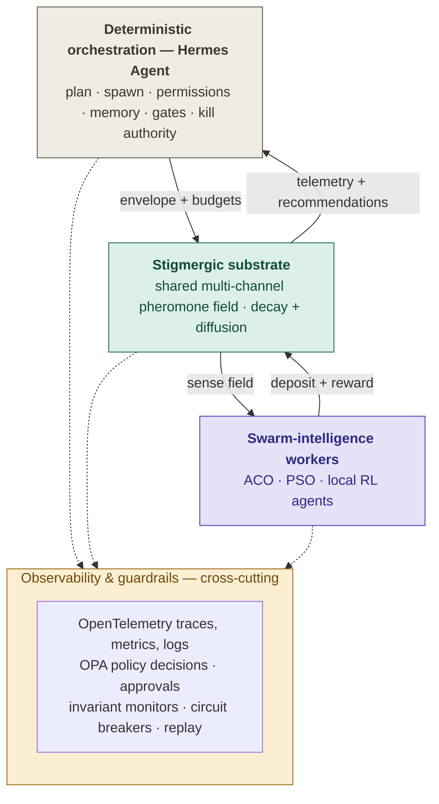
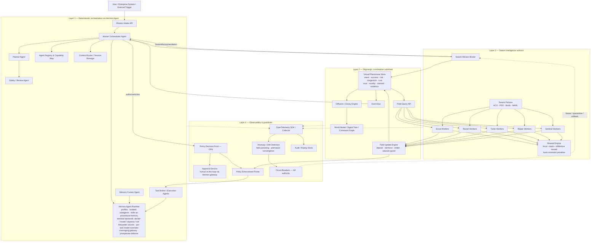
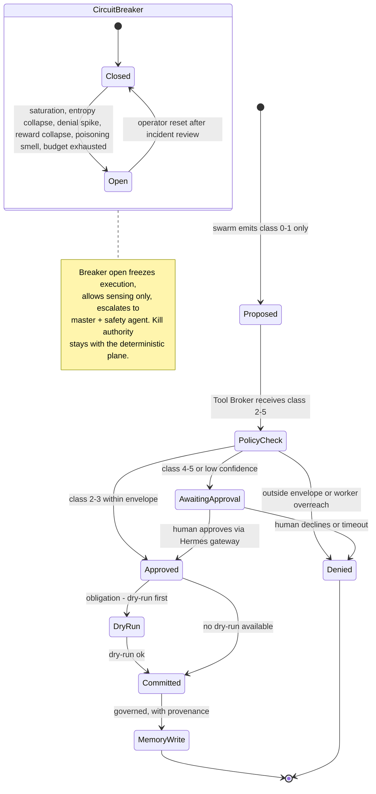
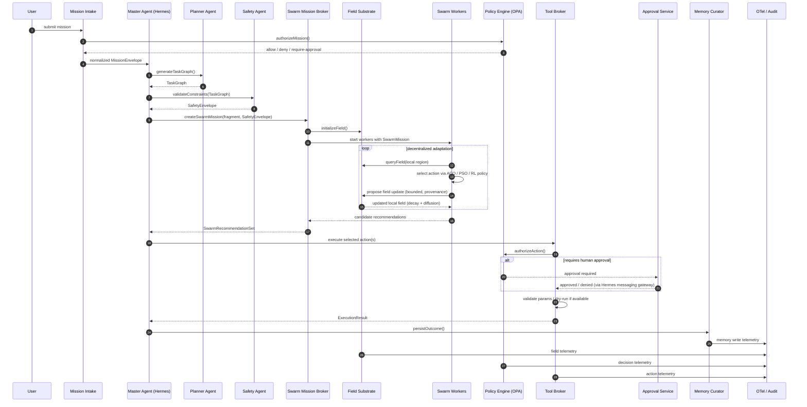

# Hybrid Agentic Swarm (HAS) Reference Architecture v2

**v2 changes at a glance:** the deterministic orchestration plane is now **Hermes Agent (Nous Research)** instead of OpenClaw; the two v1 documents are merged into one architecture (the formal four-plane spec and interface contracts from the reference-architecture document, plus the "determinism as envelope" control philosophy, multi-channel field semantics, difference rewards, and substrate-poisoning defenses from the conceptual document); and the reference implementation in `src/has/` makes the whole loop runnable with zero dependencies.

## 1. The organizing principle

The mistake most "swarm + LLM" designs make is trying to make the two paradigms cooperate as peers. They shouldn't. The right relationship is **containment**: the deterministic layer never directs the swarm's moment-to-moment choices; it defines the walls of the box the swarm is allowed to explore in. Orchestration owns invariants, budgets, permissions, and kill authority. The swarm owns search, adaptation, and local decisions. They are coupled through exactly one medium — the stigmergic substrate — which is therefore also the single place you instrument and defend. Keeping the coupling to one narrow interface is what makes an emergent system auditable at all.

The shortest accurate summary of the whole system:

> Hermes Agent governs who may act, with what context, memory, tools, and constraints. The stigmergic substrate governs what the swarm perceives and reinforces. Swarm workers search and adapt locally. The policy plane decides what may become real. The observability plane remembers everything important.



*Canonical source: [`diagrams/has_v2_conceptual.mmd`](../diagrams/has_v2_conceptual.mmd)*

The system is partitioned into four planes. The three stacked layers are the data path (top-down control → shared field → swarm); the arrows between them are the *only* coupling points; the guardrail band observes all three at once.

## 2. Control philosophy — who decides what

| Deterministic plane decides | Swarm plane decides |
|---|---|
| mission intent and decomposition | local path selection and prioritization |
| role assignment and allowed tools | adaptive rerouting |
| credentials and hard constraints | exploration vs. exploitation balance |
| budget ceilings and escalation thresholds | decentralized peer coordination via the field |
| memory persistence and audit boundaries | field updates and micro-actions inside the policy boundary |
| kill authority (freeze, quarantine, rollback) | — the swarm can never revoke kill authority |

Emergence is allowed only inside a governed envelope.

## 3. Layer 1 — Deterministic orchestration via Hermes Agent

The full component map across all four layers:



*Canonical source: [`diagrams/has_v2_layered_architecture.mmd`](../diagrams/has_v2_layered_architecture.mmd)*

This layer owns governed task planning and execution. Its job is *not* to plan the swarm's work; it is to define the box the swarm plays in, and to hold kill authority.

**Components** (unchanged in role from v1): Mission Intake API, Master Orchestrator Agent, Planner Agent, Safety/Review Agent, Memory Curator Agent, Tool Broker / Execution Agents, Context Router / Session Manager, Agent Registry and Capability Map — all hosted on the Hermes Agent runtime.

### 3.1 Mapping onto Hermes Agent primitives

Hermes Agent (Nous Research, MIT-licensed, released February 2026) is a self-hosted agent runtime with isolated subagent delegation, a skills system compatible with the agentskills.io open standard, persistent cross-session memory with FTS5 recall, a multi-platform messaging gateway, MCP support, and pluggable terminal backends. The v1 OpenClaw concepts map as follows:

| v1 (OpenClaw) | v2 (Hermes Agent) |
|---|---|
| per-agent workspace + agentDir | Hermes profile per governed agent; isolated subagents with their own conversations and terminals |
| per-agent tool allow/deny | toolset configuration + MCP tool filtering, started from **Blank Slate** setup (everything off, opt-in only) |
| per-agent auth profiles | **Bitwarden Secrets Manager** scopes — one bootstrap token, no raw provider keys in agent context |
| sandbox / workspace access controls | **terminal backends** as the isolation boundary: `docker`, `modal`, `daytona`, `ssh`, `singularity` (never `local` for tool-executing agents) |
| workspace Markdown memory (MEMORY.md) | Hermes agent-curated memory + FTS5 cross-session recall; **skills = procedural memory** (SKILL.md files) |
| skills (static, hand-authored) | Hermes **learning loop** — autonomous skill creation and self-improvement, which v2 treats as a governed memory-write path (see §3.4) |
| custom system prompt per run | context files + SOUL.md + per-run assembly; the ContextPackage contract governs what each agent sees |
| single model per agent | **per-task model overrides** and smart routing — cheap policy models for workers, heavy reasoner on escalation (this natively implements the v1 cost model) |
| — (no equivalent) | messaging gateway (Telegram/Slack/Signal/Teams/20+ platforms) as the **human-approval delivery channel** |
| — (no equivalent) | built-in cron for scheduled swarm missions |
| — (no equivalent) | **Atropos RL integration + trajectory export** — the offline training substrate for Layer 3 policies (see §5.4) |
| prompt-injection risk noted in docs, advisory guardrails | **promptware defense** at three chokepoints: tool output, recalled memory, stored skills — keep enabled on every governed profile |

### 3.2 Governed deployment posture

Five rules make Hermes safe to use as a control plane. First, start every governed agent from Blank Slate setup so nothing is enabled that policy did not opt into. Second, run tool-executing agents in an isolated terminal backend (Docker at minimum; Modal/Daytona for serverless isolation). Third, deliver credentials only through Bitwarden Secrets Manager scopes named in the spawn contract — agents never hold raw keys. Fourth, disable the per-session approval bypass (`/yolo`) on governed profiles; all approvals ride the messaging gateway to a named human. Fifth, disable autonomous skill creation on governed agents: skills are *executable procedural memory*, so skill persistence flows through the governed memory-write contract with provenance, exactly like any other curated memory write. (Hermes' own promptware defense scans stored skills as an injection chokepoint, which is independent confirmation that skills are an attack surface.)

### 3.3 Context management

Context is tiered, and the tiers are contracts, not conventions. Every worker carries a small immutable **constitution** (objective, invariants, forbidden actions). Above that sit the global mission context (objective vector, business constraints, legal/safety envelope, budget, horizon), the role context (capability manifest, policy scope, permitted APIs), the session context (execution trace, working notes, active handoffs, current field-snapshot hash), and long-term memory references. The Context Router decides what each agent sees and when; the `ContextPackage` contract in `src/has/contracts.py` is the wire format.

### 3.4 Persistent memory model

v2 unifies the two v1 memory taxonomies into four governed stores. **Episodic** memory records what happened, for audit and replay. **Semantic** memory holds validated facts, SOPs, and incident patterns. **Procedural** memory holds reusable playbooks — in Hermes, these are literally skills, which is why skill writes are governed. **Swarm** memory is the field itself: pheromone maps, reward histories, and route histories, decayed but queryable. Memory writes are governed events with provenance, never casual side effects; curated (semantic/procedural) writes without provenance are rejected (`GovernedMemory` enforces this).

### 3.5 RBAC and policy — the caveat that carries over

Hermes, like OpenClaw before it, is a self-hosted, operator-centric agent runtime, not an enterprise multi-user RBAC platform. Its per-profile isolation, secrets scoping, and terminal-backend sandboxing give strong *agent-level* isolation, and its promptware defense hardens the context window — but final authorization must remain externalized: an identity provider for users and services, OPA as the policy decision engine, the Tool Broker as the enforcement point, short-lived credentials, and capability tokens for subagents. The action-class ladder (§6.2) is the shared vocabulary between all of them.

### 3.6 Spawn governance

Spawning is governed by hard caps — max concurrent agents, max spawn depth, max tokens/cost per cohort — because emergent systems are vulnerable to fork-bomb dynamics where agents keep spawning agents. The caps live in the `MissionEnvelope` and are enforced by the Master Orchestrator before any spawn call reaches the Hermes runtime.

## 4. Layer 2 — Stigmergic coordination substrate

The heart of the design and the part most designs underspecify. Stigmergy means agents coordinate by modifying a shared environment rather than by messaging each other. Concretely, the substrate is a *spatiotemporal, decaying, multi-channel key-value store* over a problem-defined topology: graph nodes for routing problems, discretized regions for optimization, geo-cells for physical problems, embedding-space clusters for information problems.

### 4.1 Field channels

v2 unifies the two v1 channel sets into nine channels. From the formal spec: **intent** (unsatisfied task demand), **success** (recent positive payoff — subsumes "promise"), **risk** (safety/compliance/danger/taboo), **congestion**, **cost**, **trust**, **novelty**. From the conceptual spec, two additions: **claimed** (another worker is already here — prevents redundant work) and **evidence** (observed ground-truth strength, distinct from optimistic reinforcement).

### 4.2 Six primitives, three continuous operators

Workers interact with the field through deposit, diffuse, decay, sense, reinforce, and inhibit. Three operators run continuously: **deposit** (agents add signal), **evaporation** (exponential decay, so stale information self-erases — this is what lets the system track a moving target), and **diffusion** (a smoothing kernel spreads signal to neighbours, creating gradients agents can climb). The Field Update Engine also applies a **saturate guard**: positive deposits lose effectiveness as a channel approaches its ceiling, so runaway reinforcement asymptotes instead of pinning the field (the MAX-MIN ant-system insight, enforced at the substrate rather than in each algorithm).

### 4.3 Storage pattern

The engineering reality is unglamorous and reassuring: a Redis-with-TTL layer (or CRDT store for eventual consistency across distributed workers) for the hot path, a graph store for topology, a time-series/lakehouse for historical reward and convergence analysis, and an append-only event stream for audit. The reference implementation keeps all of it in-process behind the same contracts.

### 4.4 The feedback loop

A full cycle: worker senses local field values → chooses an action via its local policy → the outcome is measured → the reward engine scores it → the field update engine deposits/reinforces/inhibits → diffusion and decay update the global field → the orchestration plane observes macroscopic changes via the event bus → the master agent re-plans if thresholds are crossed. This loop is the bridge between deterministic orchestration and decentralized adaptation, and the substrate's narrow API (`SwarmMission` in, `FieldSnapshot`/`SwarmRecommendation` out) is what keeps orchestration from micromanaging the swarm.

### 4.5 Substrate defense (v2 hardening)

Because agents trust the field, an adversary — or a malfunctioning agent — that can write to the substrate can *poison the field* and steer the whole swarm toward a bad basin. This is a genuinely under-appreciated attack surface, so the substrate enforces its own invariants: per-update delta bounds per channel, per-worker deposit-rate limits in a sliding window, provenance on every deposit (worker id + causation id, retained in the audit stream), clamped channel ranges with the saturate guard, and a role gate on the risk channel — it cannot be *reduced* by non-sentinel workers. Rejected deposits are themselves telemetry, and a rejected-deposit spike trips the circuit breaker.

## 5. Layer 3 — Swarm-intelligence workers

Workers are deliberately lightweight — the cost model breaks if every worker is an expensive LLM call — so most workers are cheap policies (small models or classical heuristics) with occasional escalation to a heavy reasoner for genuinely ambiguous decisions. On Hermes, that escalation is a per-task model override. Each worker runs the same tight loop: sense the local field → decide → act → deposit → update.

### 5.1 Worker archetypes

**Scouts** explore low-confidence areas, gather missing state, and boost the novelty and evidence channels. **Routers** solve discrete path/sequence/allocation choices, ACO-biased. **Tuners** optimize continuous parameters, PSO-biased. **Repair** workers respond to disruptions and seek local feasible alternatives. **Sentinels** monitor danger/risk/trust and place negative pheromones — they are the only role permitted to lower the risk channel. **Arbitration** workers compare local candidates and identify consensus or diversity needs.

### 5.2 Algorithm selection

Do not force one algorithm everywhere. ACO fits routes, assignments, sequencing, and graph-like spaces (agents lay trails; good paths accumulate pheromone, bad ones evaporate). PSO fits continuous parameter search (particles pulled toward their own best-found and the swarm's best-found position). Boids/flocking fits coordinating moving resources and spatial coherence. RL/MARL fits non-stationary environments with delayed rewards where policy improvement matters more than static optimization. Artificial-bee-colony patterns help explore/exploit balancing, and artificial-immune-system patterns suit anomaly detection.

### 5.3 Reward design

The reward is factorized and constraint-aware. The canonical form:

```
R_t = α·V_t − β·C_t − γ·K_t − δ·S_t + ε·N_t + ζ·T_t + η·D_t
```

where V is mission value created, C operational cost, K congestion, S safety/compliance penalty, N novelty, T team contribution — and, new in v2, **D is the difference reward**: the worker's marginal contribution to the collective outcome, roughly "how much worse would the collective have done without me?" If each worker maximizes only its local reward you get greedy, myopic, sometimes actively counterproductive collective behavior; the difference reward aligns selfish local learning with the global objective and tames the credit-assignment problem that otherwise makes multi-agent RL diverge. v2 also adds a **redundancy penalty** driven by the `claimed` channel. Hard-constraint violations produce an immediate large negative reward, invalidate the action, and may truncate the episode, with an alert to the orchestration layer.

### 5.4 Training and deployment

Three modes, graduated: **offline simulation training** against the digital twin with synthetic disruptions and adversarial scenarios; **shadow mode** in the live environment, recommendations only; then **bounded online adaptation** with safe parameter ranges, approval gates, and rollback. New in v2: Hermes' research tooling is the natural training substrate — batch processing and trajectory export feed offline training, and the **Atropos** RL integration closes the loop for MARL policy improvement. (RLlib's multi-agent API remains a fine alternative for per-agent observation/reward dictionaries and centralized-training/decentralized-execution.)

## 6. Layer 4 — Observability and guardrails

Because behavior is emergent, you cannot certify it by inspecting code — you certify it by monitoring invariants at runtime and retaining the authority to stop. This layer is not a safety add-on; it is the thing that makes an emergent system deployable at all.

### 6.1 Observability

OpenTelemetry everywhere: traces for the mission → sub-agent → tool → substrate → action chain; metrics for throughput, reward, convergence, policy denials, drift; logs for prompts, tool arguments, field changes, memory writes, and policy decisions. Required correlation ids: `mission_id`, agent/worker ids, `policy_decision_id`, `field_update_id`, `tool_call_id`, `memory_write_id`, and `causation_id` on every stateful change. The audit/replay store keeps recommendations, decisions, approvals, executions, field updates, and memory writes immutable, so any emergent decision can be reconstructed: why this action was chosen, what the field looked like, what policy approved it, what alternative the swarm rejected.

### 6.2 Action classes and enforcement

The action-risk ladder is the shared vocabulary of the whole guardrail plane: **0** observe, **1** recommend, **2** simulate/dry-run, **3** reversible execution, **4** bounded real-world execution, **5** irreversible/high-impact. Enforcement rules: swarm workers may emit only classes 0–1 directly; classes 2–5 must pass through the Tool Broker; classes 4–5 require policy evaluation; class 5 always requires human approval unless exempted by signed policy; curated memory writes require provenance; risk-channel reductions are sentinel-only. Only classes 0–3 should be fully autonomous in early deployments. `policies/action_classes.rego` expresses these rules for OPA; `src/has/policy.py` mirrors them in-process.

The action lifecycle through the guardrail plane:



*Canonical source: [`diagrams/has_v2_guardrail_lifecycle.mmd`](../diagrams/has_v2_guardrail_lifecycle.mmd)*

### 6.3 Emergent-behavior detection and circuit breakers

The guardrail plane watches for the pathologies swarms are prone to: **premature convergence** (success-channel entropy collapse — everyone piled onto one mediocre solution too early), **oscillation**, and **runaway feedback loops**, injecting counter-signal (dampening the dominant pheromone, forcing exploration) before tripping. Circuit breakers trip on reward collapse, anomalous convergence, policy-denial spikes, tool-error spikes, rejected-deposit spikes (poisoning smell), unsafe field amplification, cost overrun, trust collapse, or human override. When tripped: freeze worker action execution, continue sensing only, escalate to master and safety agents, emit an incident trace. Kill authority — freeze, quarantine a cohort, roll the substrate back to a checkpoint — stays with the deterministic plane; the swarm can never revoke it.

### 6.4 Prompt and context hardening

Hermes' promptware defense (chokepoint scanning of tool output, recalled memory, and stored skills, with delimiter markers so external content can't impersonate system content) covers the runtime side. The architecture adds: classify inbound content by trust level, strip executable instructions from retrieved content, separate evidence from executable prompts, and force proposal mode for decisions made from untrusted context.

## 7. End-to-end mission flow



*Canonical source: [`diagrams/has_v2_control_flow.mmd`](../diagrams/has_v2_control_flow.mmd)*

Phase 1, intake: the mission envelope is created and policy-validated; the governed cohort is spawned on Hermes. Phase 2, deterministic planning: the planner builds the task DAG, the safety agent attaches hard constraints, the tool broker issues capability tokens, the memory curator loads relevant prior episodes. Phase 3, swarm mission issuance: the broker converts a DAG fragment into a field objective and the substrate initializes pheromone channels. Phase 4, decentralized navigation: workers explore and exploit, update the field, the reward engine scores, the field diffuses and decays, recommendations flow upward. Phase 5, execution: tool agents execute approved actions, results land in memory and telemetry, policy re-checks high-risk transitions. Phase 6, replanning/closure: the master monitors macro-state, re-plans or terminates on thresholds, and the final outcome, audit record, and learned memory are saved.

## 8. Build order

Phase 1: mission intake, master agent, planner, tool broker, OPA checks, OTel traces, a simple pheromone store, scout and router workers, recommendation-only mode — this repo's quickstart is exactly this phase. Phase 2: reward engine refinements, diffusion/decay tuning, memory curator, replay store, anomaly detection, human approvals, dry-run-then-commit. Phase 3: the RL/MARL training loop (Atropos), digital-twin integration, adaptive reward shaping, circuit-breaker hardening, class-3 bounded autonomy.

## 9. Where this genuinely breaks

Three hard problems remain unsolved, and any credible deployment plan has to name them. **Verification:** you can prove properties of the envelope but not of the emergent behavior — a real trade of specifiability for adaptability, sometimes unacceptable in safety-critical domains. **Credit assignment at scale:** difference rewards need a counterfactual estimate of "the collective without me," which gets expensive and noisy as the swarm grows. **The cost/benefit cliff:** swarms only beat a single strong agent when the problem is genuinely decomposable, turbulent, and parallel; the practitioners' advice to exhaust a single agent first is correct, and most problems people want to throw a swarm at are better served by one good agent with good tools.

A pattern worth naming: the swarm is almost never the decision-maker. It is a decentralized sensing-and-search fabric that maintains a live shared picture of a turbulent situation and proposes where to act — with a human, or a hard interlock, holding authority over consequential and irreversible actions. That division is the "determinism as envelope" principle, and it is what keeps these systems from being reckless.
